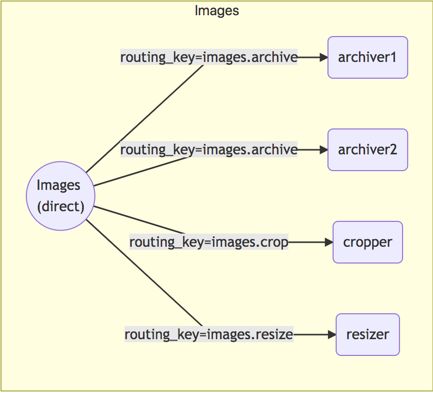

# rabbit-mermaid [![NPM version][npm-image]][npm-url] [![Build Status][travis-image]][travis-url] [![Dependency Status][daviddm-image]][daviddm-url] [![Coverage percentage][coveralls-image]][coveralls-url]

> Generate markdown flowcharts of your rabbitmq topology.

rabbit-mermaid takes your rabbitmq topology files and turns them into
markdown flowcharts. Direct, fanout, and topic-based exchanges are supported.

## Installation

```sh
$ npm install rabbit-mermaid --save
```

## Usage

```js
const { MermaidGenerator } = require("rabbit-mermaid");
const topology = {
  exchanges: [
    {
      name: "images",
      vhost: "/",
      type: "direct",
      durable: true,
      auto_delete: false,
      internal: false,
      arguments: {}
    }
  ],
  queues: [
    {
      name: "archiver1",
      vhost: "/",
      durable: true,
      auto_delete: false,
      arguments: {}
    },
    {
      name: "archiver2",
      vhost: "/",
      durable: true,
      auto_delete: false,
      arguments: {}
    },
    {
      name: "cropper",
      vhost: "/",
      durable: true,
      auto_delete: false,
      arguments: {}
    },
    {
      name: "resizer",
      vhost: "/",
      durable: true,
      auto_delete: false,
      arguments: {}
    }
  ],
  bindings: [
    {
      source: "images",
      vhost: "/",
      destination: "archiver1",
      destination_type: "queue",
      routing_key: "images.archive",
      arguments: {}
    },
    {
      source: "images",
      vhost: "/",
      destination: "archiver2",
      destination_type: "queue",
      routing_key: "images.archive",
      arguments: {}
    },
    {
      source: "images",
      vhost: "/",
      destination: "cropper",
      destination_type: "queue",
      routing_key: "images.crop",
      arguments: {}
    },
    {
      source: "images",
      vhost: "/",
      destination: "resizer",
      destination_type: "queue",
      routing_key: "images.resize",
      arguments: {}
    }
  ]
};

const mermaidGenerator = new MermaidGenerator(topology);
const opts = {};

console.log(mermaidGenerator.generate(opts));

/** Output:
graph LR
subgraph Images
Images(("Images<br/>(direct)"))
Images --routing_key=images.archive--> archiver1("archiver1")
Images --routing_key=images.archive--> archiver2("archiver2")
Images --routing_key=images.crop--> cropper("cropper")
Images --routing_key=images.resize--> resizer("resizer")
end
**/
```

Drop the generated output into a markdown file that supports [mermaid](https://mermaidjs.github.io/) and you will get



# Options

rabbit-mermaid has a handful of customizable format options.

## Chart Direction

Specifies the direction of the graph layout.

* TB - top bottom
* BT - bottom top
* RL - right left
* LR - left right

* TD - same as TB

| Default | API Override                         |
| ------- | ------------------------------------ |
| `LR`    | `chartDirection: "<LR|RL|TB|BT|TD>"` |

## Exchanges

Specify the exclusive list of exchanges that you want in your output. All other exchanges will be ignored.

| Default | API Override               |
| ------- | -------------------------- |
| `ALL`   | `exchanges: Array<string>` |

## Exchange to Exchange Bindings

Whether or not to display exchange to exchange bindings in the generated output. This is disabled by default to reduce noise in large topologies with many dependencies.

| Default | API Override                     |
| ------- | -------------------------------- |
| `false` | `showExToExBindings: <boolean>"` |

## License

MIT © [David Salas]()

[npm-image]: https://badge.fury.io/js/rabbit-mermaid.svg
[npm-url]: https://npmjs.org/package/rabbit-mermaid
[travis-image]: https://travis-ci.org/davidlivingrooms/rabbit-mermaid.svg?branch=master
[travis-url]: https://travis-ci.org/davidlivingrooms/rabbit-mermaid
[daviddm-image]: https://david-dm.org/davidlivingrooms/rabbit-mermaid.svg?theme=shields.io
[daviddm-url]: https://david-dm.org/davidlivingrooms/rabbit-mermaid
[coveralls-image]: https://coveralls.io/repos/davidlivingrooms/rabbit-mermaid/badge.svg?branch=master
[coveralls-url]: https://coveralls.io/r/davidlivingrooms/rabbit-mermaid?branch=master
